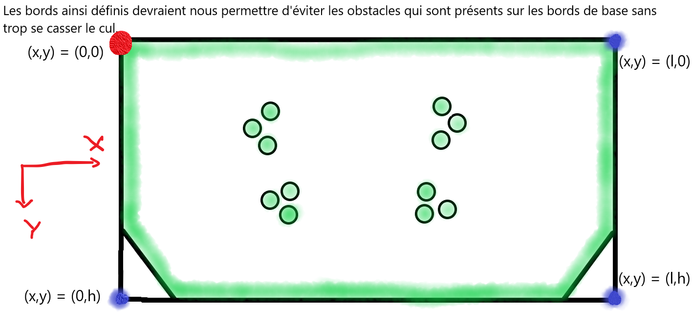

# Path planning of a autonomous mobile robot

## Contents
1. [Introduction](#introduction)
2. [Potential Field Method](#potential-field-method)
3. [Implementation](#implementation)
4. [Conclusion](#conclusion)

## Introduction
Autonomous mobile robots are robots that can move around in their environment without the guidance of a human. They are able to sense their environment and navigate without human input. Autonomous robots are becoming more and more important in our society every day, from self-driving cars to robots that can clean our houses. 

In this project, we will be focusing on the path planning of an autonomous mobile robot. Path planning is the process of finding a path from a starting point to a goal point while avoiding collisions with obstacles and optimising the travel time. There are many different path planning algorithms, but in this project, we will be focusing on the potential field method. 

## Potential Field Method
The potential fiel algorithm is a local path planning algorithm. It is based on the idea that the robot is attracted to the goal and repelled by obstacles. 

The principal idea of the potential field method is to create a potential field around the robot. The potential field is a function that assigns a value to each point in the environment. The value of the potential field is high around the obstacles and low around the goal. The robot will then move in the direction of the steepest descent of the potential field.

The potential field method is a local path planning algorithm. This means that the robot will only be able to see the obstacles that are in its field of view. This is a disadvantage of the potential field method because the robot will not be able to plan a path if the goal is not in its field of view. 

This could lead to the robot getting stuck in a local minimum. A local minimum is a point in the potential field where the robot is surrounded by obstacles. The robot will not be able to see the goal and will not be able to find a path to the goal. Certain modifications can be made to the potential field method to avoid this problem.

But the potential field method have a big advantage, it is very fast compputed which is very important for a robot that needs to move in real time.

In my opinion, the A* algorithm should be considered as a good competitor to the potential field. The A* algorithm is a global path planning algorithm. This means that the robot will be able to see the entire environment and plan a path to the goal. The A* algorithm is also very fast and can be used in real time. 

Furthermore, the potential field will require a lot of tuning to work properly which is highly time consumining and environment dependedent. In my vision, the potential field method is also very environement implementation dependent. As exemple, in the begining of the project we had impelmented each obstacle as a different object with differend weight and influence radius. But we had to change this implementation because it was not working properly. We had to implement the obstacles (all other than the opponent) as a single object composed of a multitude of points with a single weight and influence radius. This modification has improved drastically the performance of the potential field method. this result prove the low robustness of the potential field method.

But even if the potential field method is not the best path planning algorithm, it is still a very good algorithm that can be used in many different applications. 

## Implementation 

### Foreword

The first part of the process is the definition of the mobile robot environnement. By descripting the map, the obstacle,  the oponent and the goal. 

The definition used in this context is the following : 

### Code files description

- Potential_Field_Force.h : This file define the structures used in the code. It also define the functions used in the code.

- Potential_Field_Force.cpp : This file contains the main code of the potential field method. It contains the function that calculate the potential field and the function that calculate the force applied on the robot.

- data.txt : This file contains the data of the log files.

- data.py : This file processes the data present in the log files. 

### Comments on the code

The provided code is an erly version of the potential field algorithm that is able to work outside of the Robotran envirennement provided by the UCLouvain LELME2732 project. The more mature version of the potential field is available in [the Code_final folder](Code_final/Raspberry/cpp-project/Sources/path).

Furthermore a visualisation tool used for the potential field tunning is also available in [the Code_final folder](Code_final/Raspberry/cpp-project/Sources/visualisation_potential). This tool was realy usefull to tune the potential field as it allowed us to see the potential field curve.

## Conclusion

This document has presented the interest and limitation of the potential field method. It has also presneted the implementation realised in the contect of the UCLouvain 2021-2022 mechatronic project.
